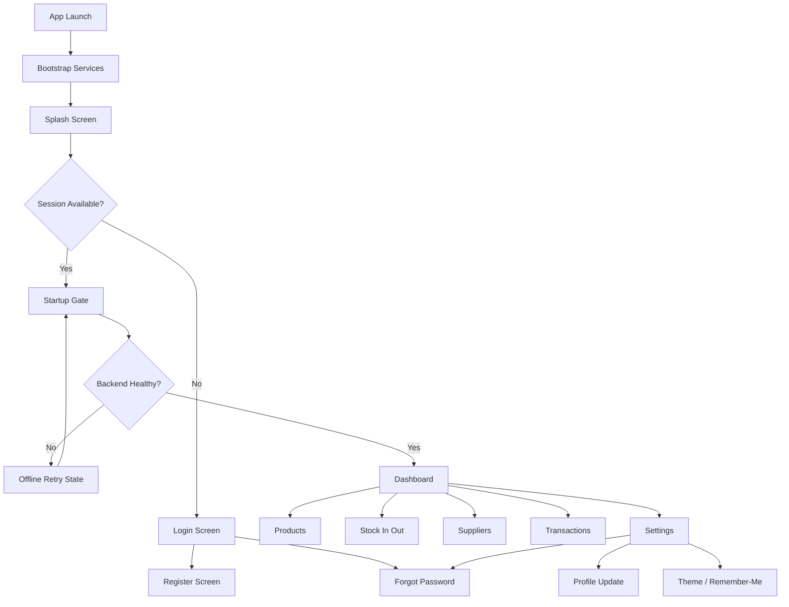
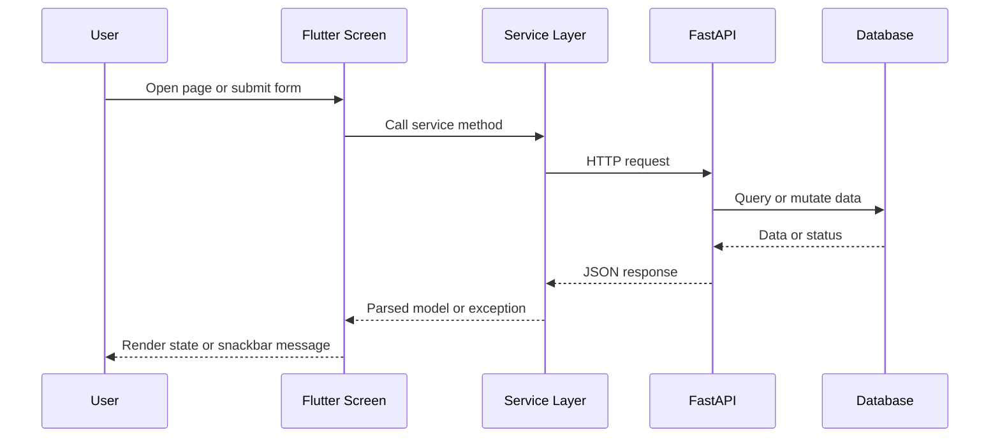

# IMS App Manual

This manual is the main entry point for understanding and operating the Flutter IMS application.

## Scope

The app is a mobile and desktop Flutter client for the FastAPI IMS backend. It supports:

- user authentication and session restore
- inventory dashboard reporting
- product management with UGX pricing
- stock in and stock out operations
- supplier management
- transaction history and filtering
- app settings and profile updates

## Quick Start

1. Start the backend API.
2. Start the Flutter app.
3. Sign in or register.
4. Open the drawer to navigate between modules.

## Core Architecture

- `lib/main.dart`: app bootstrap, theme configuration, and route initialization.
- `lib/routes.dart`: named routes with animated transitions.
- `lib/services/api_service.dart`: all non-auth backend API operations.
- `lib/services/auth_service.dart`: auth/session/reset/profile HTTP integration.
- `lib/services/app_settings_service.dart`: theme mode persistence.
- `lib/screens/`: feature screens.
- `lib/widgets/app_drawer.dart`: shared navigation drawer and logout action.

## End-to-End App Flow

## Backend Interaction Flow

## Documentation Map

- [System Overview](system_overview.md): architecture, data flow, and API contracts.
- [Pages Guide](pages_guide.md): functional behavior of each screen.
- [Code Walkthrough](code_walkthrough.md): file-by-file implementation map.
- [Error Handling Guide](error_handling.md): common failures and recovery steps.
- [Development Guide](development_guide.md): setup, commands, testing, and extension workflow.
- [main.dart Runtime Troubleshooting](main_dart_runtime_troubleshooting.md): why the app can feel blocked and why register/login fail when backend is unavailable.
- [Backend, SQLite, and Offline FAQ](offline_and_backend_faq.md): backend dependency, SQLite-only setup, and offline capability limits.

## Reading Order

1. Read this manual.
2. Read [system_overview.md](system_overview.md).
3. Read [pages_guide.md](pages_guide.md).
4. Use [code_walkthrough.md](code_walkthrough.md) while navigating source files.
5. Keep [error_handling.md](error_handling.md) and [development_guide.md](development_guide.md) open while developing.

## Current Functional Notes

- Product prices are displayed and entered as UGX in product screens.
- Settings screen includes drawer access plus a back action when route stack allows pop.
- Auth flow is backend-driven for register, login, me, logout, forgot password, reset password, and profile update.
- Remember-me persistence is supported through local storage preferences.
